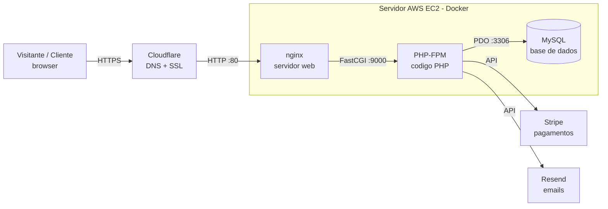

# Guia de Defesa - PAP SylviArtes

Documento de apoio para a defesa. Resume o projeto, as escolhas técnicas, a
arquitetura, a base de dados, a segurança e as perguntas mais prováveis do júri.
Lê-o algumas vezes e tenta explicar cada secção por palavras tuas.

---

## 1. O que é o SylviArtes

Plataforma web para um negócio familiar de **bordados personalizados** (peças feitas
à medida: babetes, fraldas, toalhas, etc.). Como cada peça é única e o preço depende
do que o cliente pede, o site **não funciona como uma loja de preços fixos**, mas sim
por **pedido de orçamento**:

1. O cliente vê o portfólio e pede um orçamento (descreve o que quer, com fotos de inspiração).
2. A administradora (a Sylvia) analisa, define o valor e envia um link de pagamento.
3. O cliente paga online (cartão ou MB Way) e acompanha o estado da encomenda.

**Objetivos:** dar presença online profissional ao negócio, automatizar a recolha de
pedidos, os pagamentos e a comunicação com o cliente, e ter um painel de gestão simples.

---

## 2. Tecnologias e PORQUÊ de cada escolha

| Tecnologia | Para quê | Porque escolhi |
|---|---|---|
| **PHP 8.2** (sem framework) | Lógica do servidor | Domínio da linguagem; sem framework percebo e explico cada linha (importante na PAP). |
| **MySQL 8.0** | Base de dados | Relacional, ideal para clientes/pedidos/pagamentos com relações claras. |
| **PDO + prepared statements** | Acesso à BD | Seguro contra SQL injection e portável. |
| **HTML/CSS + Bootstrap 5** | Interface | Rápido de tornar responsivo; CSS próprio para o visual da marca. |
| **JavaScript (vanilla)** | Interação (estrelas, upload de fotos) | Sem dependências pesadas. |
| **Docker (Compose)** | Alojamento | Empacota nginx + PHP + MySQL em "caixas" iguais em qualquer servidor. |
| **Stripe** | Pagamentos | Plataforma segura e reconhecida; suporta cartão e MB Way; eu nunca toco nos dados do cartão. |
| **Resend** | Envio de emails | API simples e fiável para enviar do domínio verificado (noreply@sylviartes.pt). |
| **Cloudflare** | DNS + HTTPS | Dá HTTPS grátis e protege/acelera o site. |
| **AWS EC2 (Ubuntu)** | Servidor | Servidor na cloud onde corre o Docker. |

---

## 3. Arquitetura (como está montado)



Versão em texto (caso o diagrama não renderize):

```
Cliente (browser, HTTPS)
        |
        v
   Cloudflare  (DNS + HTTPS/SSL)
        |  (HTTP na porta 80)
        v
+----------------- Servidor AWS EC2 (Docker) -----------------+
|   nginx  --FastCGI-->  PHP-FPM  --PDO-->  MySQL             |
+-------------------------------------------------------------+
        |                         |
        v                         v
     Stripe (pagamentos)      Resend (emails)
```

**3 containers Docker:** `meu-nginx-pap` (porta 80), `meu-php-pap` (PHP-FPM), `meu-mysql-pap`
(MySQL, dados num volume persistente). O nginx serve os ficheiros estáticos e encaminha
os `.php` para o PHP-FPM; o PHP liga ao MySQL pela rede interna do Docker.

---

## 4. Base de dados

**12 tabelas** principais, com relações por chave estrangeira. Resumo:

- **utilizador** - clientes e administradores (campo `nivel_acesso`). Password em bcrypt.
- **categoria** - tipos de bordado (Babetes, Fraldas, Toalhas...).
- **produto** + **produto_imagem** - itens do portfólio e as suas fotos.
- **pedido** - encomenda do cliente (estado, prazo, entrega, total).
- **detalhe_pedido** - linhas de cada pedido (produto, quantidade).
- **pagamento** - método e estado do pagamento (ligado ao Stripe).
- **avaliacao** - estrelas + comentário; ligada ao cliente e à encomenda (`pedido_id`).
- **pedido_inspiracao** - fotos que o cliente envia como inspiração.
- **mensagem_pedido** - mensagens trocadas sobre um pedido.
- **log_alteracoes_pedido** - histórico de mudanças de estado (auditoria).
- **password_reset** - tokens de recuperação de password.

Além das tabelas, a BD tem **7 views** (ex.: dashboard, produtos mais vendidos),
**4 procedimentos** e **16 triggers** (ex.: validar estrelas entre 1 e 5, registar
alterações de estado). Tudo está num único ficheiro: `docs/db/bd_sylviartes.sql`, e
documentado em `docs/db/documentacao_bd.md`. O modelo visual está em `docs/db/modelo.mwb`
(MySQL Workbench).

> Detalhe importante para explicar: como as peças são feitas à medida, o `stock` dos
> produtos é `NULL` (não há stock fixo). Os triggers tratam `NULL` como "ilimitado/à medida".

---

## 5. Fluxo de uma encomenda (do início ao fim)

1. **Pedido** - o cliente preenche o formulário em `pedir-orcamento.php` (descrição,
   tipo de entrega, fotos de inspiração). É criado um `pedido` com estado **em análise**.
   (O login é opcional, mas há uma conta para acompanhar o pedido.)
2. **Aviso** - a administradora recebe um email (Resend) a dizer que entrou um pedido novo.
3. **Orçamento** - no painel admin, a Sylvia analisa, define o `valor_total` e envia o
   **link de pagamento Stripe** por email ao cliente (`enviar_link.php`).
4. **Pagamento** - o cliente paga (cartão / MB Way) na página segura do Stripe.
5. **Confirmação automática** - o Stripe avisa o site (`stripe_webhook.php`, evento
   `invoice.paid`), que marca o pagamento como validado e o pedido como **em produção**.
6. **Produção e entrega** - a Sylvia muda o estado (em produção -> concluído -> entregue).
   A cada mudança, o cliente **recebe um email** automático.
7. **Avaliação** - depois de concluída, o cliente pode **avaliar a encomenda** (estrelas +
   comentário). Após aprovação no admin, aparece como testemunho na página inicial.

---

## 6. Segurança (o que protege o site)

- **Passwords em bcrypt** (`password_hash` / `password_verify`) - nunca guardadas em texto.
- **Prepared statements (PDO)** em todas as queries - protege contra **SQL injection**.
- **htmlspecialchars** ao mostrar dados - protege contra **XSS**.
- **Tokens CSRF** nos formulários - impede pedidos forjados de outros sites.
- **Throttle de login** - bloqueia 5 minutos após 5 tentativas falhadas (anti força bruta).
- **Cabeçalhos de segurança HTTP** no nginx (X-Frame-Options, X-Content-Type-Options,
  Referrer-Policy, Content-Security-Policy).
- **HTTPS** em todo o site (via Cloudflare).
- **Sessões seguras** + `session_regenerate_id` no login (evita session fixation).
- **Verificação de dono** - cada cliente só vê os seus próprios pedidos (`WHERE utilizador_id = ?`).
- **Pagamentos no Stripe** - o site nunca recebe nem guarda dados de cartão.
- **Segredos no `.env`** (fora do código e do git).

---

## 7. Perguntas prováveis do júri (e respostas)

**"Porque não usaste um framework (Laravel, Symfony)?"**
Para perceber e explicar tudo o que acontece "por baixo". Num framework muita coisa é
automática; em PHP puro mostro que domino sessões, PDO, segurança e a estrutura MVC à mão.

**"Como garantes que ninguém entra na conta de outro cliente?"**
Todas as queries de dados do cliente filtram por `utilizador_id` da sessão. Mesmo que
alguém mude o id no URL, a query não devolve nada que não seja dele.

**"E se tentarem injetar SQL no formulário?"**
Uso sempre prepared statements (PDO) com parâmetros, por isso o input do utilizador
nunca é concatenado na query. A tentativa de injeção é tratada como texto normal.

**"Onde guardas os pagamentos? É seguro?"**
O pagamento é feito na plataforma do Stripe (certificada PCI). O meu site só guarda o
estado (pago/pendente) e o id da fatura. Nunca vejo nem guardo números de cartão.

**"Como funciona o preço se as peças são à medida?"**
Não há preços fixos. O cliente pede um orçamento, a administradora define o valor e envia
um link de pagamento. Por isso o `stock` é NULL e o site é "por orçamento", não loja normal.

**"O que acontece quando o cliente paga?"**
O Stripe envia um webhook ao meu site (`invoice.paid`). O site valida o pagamento e avança
o pedido automaticamente para "em produção", e o cliente recebe email a cada mudança.

**"Porque Docker?"**
Empacota o nginx, o PHP e o MySQL em containers iguais em qualquer máquina. Evita o
"na minha máquina funciona" e torna o deploy no servidor previsível.

**"Como está alojado / como puseste online?"**
Servidor Ubuntu na AWS (EC2) com Docker. O domínio e o HTTPS são geridos pela Cloudflare.
O código é enviado por SSH e a base de dados corre num container com volume persistente.

**"O site é responsivo?"**
Sim. Uso Bootstrap + CSS próprio com media queries; em telemóvel as tabelas (encomendas,
avaliações) transformam-se em cartões para caberem no ecrã.

**"Qual foi a maior dificuldade?"**
(Responde com algo verdadeiro teu, ex.: integrar o Stripe com webhooks, ou resolver a
estabilidade do servidor / fuso horário / cache.) Mostra que diagnosticaste e resolveste.

---

## 8. Demonstração ao vivo (sugestão de guião)

1. Mostrar a página inicial e o portfólio (responsivo, no telemóvel também).
2. Fazer um **pedido de orçamento** como cliente.
3. Entrar no **painel admin** -> mostrar o pedido novo -> definir valor -> enviar link.
4. Mostrar o **email** que o cliente recebe.
5. Mostrar a **base de dados no MySQL Workbench** (ligada ao servidor) com o pedido lá.
6. Mudar o estado da encomenda -> mostrar o **email automático** ao cliente.
7. Mostrar uma **avaliação** e os **gráficos do dashboard**.

> Dica: ter o site já aberto em separadores e a ligação do Workbench ao servidor já feita,
> para não perder tempo no dia.
