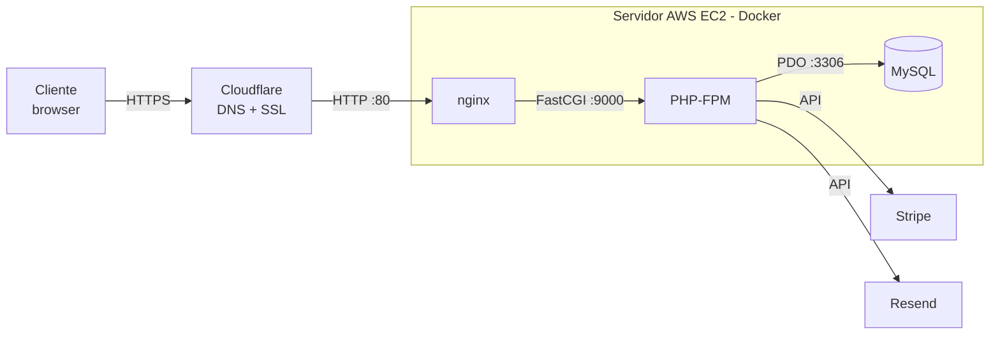

<!--
  RELATÓRIO DE PAP - SylviArtes
  Substitui os campos entre [ ] pelos teus dados.
  Onde vês [FIGURA: ...], insere uma captura de ecrã correspondente.
-->

<div align="center">

# [NOME DA ESCOLA]

### Prova de Aptidão Profissional

<br>

## SylviArtes
### Plataforma Web de Bordados Personalizados

<br><br>

**Curso:** [CURSO] (ex.: Técnico de Programação Informática)

**Autor:** [NOME DO AUTOR]

**Orientador(es):** [NOME DO(S) ORIENTADOR(ES)]

<br><br>

Ano letivo 2025/2026

[LOCALIDADE], [DATA]

</div>

<div style="page-break-after: always;"></div>

---

## Índice

a) [Folha de rosto](#nome-da-escola)
b) [Índice](#índice)
c) [Introdução](#c-introdução)
d) [Desenvolvimento](#d-desenvolvimento)
&nbsp;&nbsp;&nbsp;&nbsp;d.1) [Metodologia adotada](#d1-metodologia-adotada)
&nbsp;&nbsp;&nbsp;&nbsp;d.2) [Materiais e recursos utilizados](#d2-materiais-e-recursos-utilizados)
&nbsp;&nbsp;&nbsp;&nbsp;d.3) [Fases da realização do projeto](#d3-fases-da-realização-do-projeto)
&nbsp;&nbsp;&nbsp;&nbsp;d.4) [Documentos ilustrativos](#d4-documentos-ilustrativos-da-concretização-do-projeto)
e) [Análise crítica global](#e-análise-crítica-global-da-execução-do-projeto)
f) [Bibliografia](#f-bibliografia)
g) [Anexos](#g-anexos)

<div style="page-break-after: always;"></div>

---

## c) Introdução

O presente relatório documenta a Prova de Aptidão Profissional (PAP), que consistiu no
desenvolvimento da **SylviArtes**, uma plataforma web para um negócio familiar de
**bordados personalizados** (peças feitas à medida, como babetes, fraldas e toalhas).
A plataforma encontra-se em produção, acessível em **https://sylviartes.pt**.

### Fundamentação da escolha do projeto

A escolha deste projeto deve-se a uma necessidade real de um negócio familiar. As peças
são bordadas à medida e o negócio não tinha qualquer presença online, dependendo de
mensagens informais para receber pedidos, combinar preços e cobrar. Esta forma de
trabalhar tornava difícil acompanhar as encomendas, transmitir uma imagem profissional e
crescer.

Por ser um negócio de peças únicas, não faz sentido uma loja online tradicional de preços
fixos. A solução adequada é uma plataforma **por orçamento**: o cliente vê o portfólio e
descreve o que pretende, a administradora analisa e define um valor, e envia um link de
pagamento. Resolver este problema concreto permitiu aplicar, de forma integrada,
conhecimentos de programação web, bases de dados, segurança, integração com serviços
externos (pagamentos e email) e alojamento na cloud, o que torna o projeto adequado e
abrangente para uma PAP.

**Objetivos do projeto:**

- Dar presença online profissional ao negócio.
- Permitir que o cliente veja o portfólio e peça um orçamento online.
- Automatizar os pagamentos e a comunicação por email a cada mudança de estado da encomenda.
- Disponibilizar um painel de administração para gerir produtos, encomendas, pagamentos e avaliações.
- Garantir a segurança dos dados e o funcionamento correto em computador e telemóvel.

<div style="page-break-after: always;"></div>

---

## d) Desenvolvimento

### d.1) Metodologia adotada

O projeto foi desenvolvido de forma **incremental e iterativa**: começou-se pela base
(modelo de dados e estrutura) e foram-se acrescentando funcionalidades, testando cada uma
antes de avançar. Em cada alteração seguiu-se o mesmo ciclo de trabalho:

1. Desenvolvimento e teste em **ambiente local** (XAMPP: Apache, MySQL e PHP).
2. Verificação da sintaxe do PHP (`php -l`) antes de publicar.
3. **Publicação em produção** por SSH para o servidor (envio dos ficheiros).
4. Teste no site real e, no caso de CSS/JavaScript, atualização da versão (cache-busting)
   para o browser carregar a versão nova.
5. **Versionamento com Git**, mantendo um histórico das alterações.

Foi também adotada uma metodologia de **resolução de problemas** sempre que surgiram falhas
em produção (ver Análise Crítica): diagnóstico da causa, aplicação da correção e validação
de que o problema ficou resolvido sem afetar o resto do site.

### d.2) Materiais e recursos utilizados

**Tecnologias e justificação de cada escolha:**

| Tecnologia | Para quê | Porquê foi escolhida |
|---|---|---|
| **PHP 8.2** (sem framework) | Lógica do servidor | Domínio da linguagem; sem framework é possível compreender e explicar cada linha de código. |
| **MySQL 8.0** | Base de dados | Relacional, ideal para gerir clientes, pedidos e pagamentos com relações bem definidas. |
| **PDO + prepared statements** | Acesso à base de dados | Seguro contra SQL injection e portável entre servidores. |
| **HTML, CSS e Bootstrap 5** | Interface | Rápido de tornar responsivo; com CSS próprio para o visual da marca. |
| **JavaScript (vanilla)** | Interação (estrelas de avaliação, upload de fotos) | Sem necessidade de bibliotecas pesadas. |
| **Docker (Compose)** | Alojamento | Empacota o servidor web, o PHP e a base de dados em containers iguais em qualquer máquina. |
| **Stripe** | Pagamentos | Plataforma segura (certificada PCI); suporta cartão e MB Way; o site nunca acede aos dados do cartão. |
| **Resend** | Envio de emails | API simples e fiável, a partir de um domínio verificado (noreply@sylviartes.pt). |
| **Cloudflare** | DNS e HTTPS | Disponibiliza HTTPS gratuito e protege e acelera o site. |
| **AWS EC2 (Ubuntu)** | Servidor | Servidor na cloud onde corre o Docker. |

**Ferramentas de desenvolvimento:** Visual Studio Code (editor), MySQL Workbench (gestão
e modelação da base de dados), Composer (gestão de bibliotecas PHP), Git (controlo de
versões) e XAMPP (ambiente de testes local).

### d.3) Fases da realização do projeto

1. **Análise e levantamento de requisitos** - compreender o negócio e definir o modelo por
   orçamento (em vez de loja de preços fixos).
2. **Modelo de dados** - desenho e criação da base de dados (12 tabelas relacionadas, mais
   views, procedimentos e triggers).
3. **Backend e área pública** - estrutura em PHP, página inicial, portfólio (catálogo),
   detalhe de produto e formulário de pedido de orçamento.
4. **Área de cliente e painel de administração** - registo/login, "As minhas encomendas",
   perfil e recuperação de password; no admin, gestão de encomendas, produtos, categorias,
   avaliações e dashboard.
5. **Pagamentos e emails** - integração com o Stripe (links de pagamento e confirmação
   automática por webhook) e com o Resend (emails automáticos).
6. **Publicação (deploy)** - alojamento em Docker no servidor AWS EC2, com DNS e HTTPS
   geridos pela Cloudflare.
7. **Segurança** - encriptação de passwords, proteção contra SQL injection, XSS e CSRF,
   limitação de tentativas de login e cabeçalhos de segurança.
8. **Responsividade e correções** - adaptação ao telemóvel e resolução de problemas
   detetados em produção.
9. **Documentação e preparação da defesa** - guia de defesa, README e este relatório.

### d.4) Documentos ilustrativos da concretização do projeto

**Arquitetura do sistema**

```
Cliente (browser, HTTPS)
        |
        v
   Cloudflare  (DNS + HTTPS/SSL)
        |  (HTTP na porta 80)
        v
+--------- Servidor AWS EC2 (Docker) ----------+
|   nginx  --FastCGI-->  PHP-FPM  --PDO-->  MySQL  |
+-----------------------------------------------+
        |                         |
        v                         v
     Stripe (pagamentos)      Resend (emails)
```



O sistema corre em **3 containers Docker**: o nginx (servidor web, porta 80), o PHP-FPM
(executa o código) e o MySQL (base de dados, com os dados num volume persistente).

**Modelo de dados (resumo)**

A base de dados tem **12 tabelas** principais, relacionadas por chave estrangeira:
`utilizador`, `categoria`, `produto`, `produto_imagem`, `pedido`, `detalhe_pedido`,
`pagamento`, `avaliacao`, `pedido_inspiracao`, `mensagem_pedido`,
`log_alteracoes_pedido` e `password_reset`. Inclui ainda **7 views**, **4 procedimentos**
e **16 triggers** (por exemplo, validar que as estrelas estão entre 1 e 5 e registar as
alterações de estado das encomendas). Como as peças são feitas à medida, o stock dos
produtos é `NULL` (sem stock fixo).

**Fluxo de uma encomenda (do início ao fim)**

1. O cliente preenche o pedido de orçamento (descrição, tipo de entrega, fotos de
   inspiração). É criada uma encomenda com estado "em análise".
2. A administradora recebe um email a avisar que entrou um pedido novo.
3. No painel admin, define o valor e envia o link de pagamento Stripe por email.
4. O cliente paga (cartão ou MB Way) na página segura do Stripe.
5. O Stripe confirma o pagamento ao site (webhook), que o valida e passa a encomenda a
   "em produção" automaticamente.
6. A administradora muda o estado (em produção, concluído, entregue); a cada mudança o
   cliente recebe um email automático.
7. Após a conclusão, o cliente pode avaliar (estrelas e comentário); depois de aprovada,
   a avaliação surge como testemunho na página inicial.

**Capturas de ecrã (inserir):**

- [FIGURA: Página inicial do site]
- [FIGURA: Portfólio / catálogo]
- [FIGURA: Formulário de pedido de orçamento]
- [FIGURA: Painel de administração - lista de encomendas]
- [FIGURA: Email automático recebido pelo cliente]
- [FIGURA: Página de pagamento do Stripe]
- [FIGURA: Modelo da base de dados no MySQL Workbench]
- [FIGURA: Site visto no telemóvel (responsivo)]

<div style="page-break-after: always;"></div>

---

## e) Análise crítica global da execução do projeto

De forma geral, o projeto atingiu os objetivos: a SylviArtes está **funcional e em
produção**, com o ciclo completo da encomenda (pedido, orçamento, pagamento, produção,
entrega e avaliação) automatizado e com um painel de gestão simples. O resultado dá ao
negócio uma presença online profissional que antes não existia.

### Principais dificuldades e como foram superadas

- **Fuso horário das encomendas** - a hora aparecia uma hora atrasada porque o servidor de
  base de dados estava em UTC. Foi resolvido configurando o fuso horário para
  Europe/Lisbon no container e recriando-o.
- **Cache do CSS** - as alterações ao estilo não apareciam devido à cache do browser e da
  Cloudflare. Foi resolvido com uma técnica de cache-busting (versão na ligação do CSS),
  forçando o carregamento da versão mais recente.
- **Adaptação ao telemóvel** - algumas tabelas ficavam cortadas. A causa principal era a
  falta da meta tag de viewport; depois as tabelas passaram a transformar-se em cartões em
  ecrãs pequenos.
- **Links dos emails a apontar para o ambiente local** - o endereço base era o de
  desenvolvimento; passou a ser calculado a partir do próprio pedido web, ficando sempre
  correto em produção.
- **Servidor a ficar indisponível** - o serviço de base de dados estava a ser terminado por
  falta de memória do servidor (tinha acontecido 21 vezes). Foi resolvido criando memória
  de troca (swap) e libertando espaço em disco (remoção de imagens e volumes Docker não
  utilizados, cerca de 600 MB).
- **Simplificação dos pagamentos** - foi removido o fluxo de transferência bancária e
  comprovativo, ficando os pagamentos centralizados no Stripe, o que tornou o processo mais
  simples e seguro.

Estas situações, por serem problemas reais de produção, foram das partes mais
enriquecedoras: obrigaram a diagnosticar a causa, aplicar a correção e validar o resultado.

### Melhorias futuras

- Guardar as imagens de inspiração como ficheiros em disco (em vez de dentro da base de
  dados), tornando a base de dados mais leve e rápida.
- Melhorar o SEO (sitemap.xml e Open Graph).
- Adicionar pesquisa e filtros por categoria no portfólio.
- Otimizar (redimensionar e comprimir) as imagens no momento do upload.
- Criar uma página de erro 404 personalizada com o visual do site.

<div style="page-break-after: always;"></div>

---

## f) Bibliografia

- PHP. *Manual do PHP*. https://www.php.net/manual/
- MySQL. *MySQL 8.0 Reference Manual*. https://dev.mysql.com/doc/refman/8.0/en/
- PHP. *PDO - PHP Data Objects*. https://www.php.net/manual/en/book.pdo.php
- Bootstrap. *Bootstrap 5 Documentation*. https://getbootstrap.com/docs/5.3/
- MDN Web Docs. *HTML, CSS e JavaScript*. https://developer.mozilla.org/
- Stripe. *Stripe Documentation*. https://docs.stripe.com/
- Resend. *Resend Documentation*. https://resend.com/docs
- Docker. *Docker Documentation*. https://docs.docker.com/
- Cloudflare. *Cloudflare Docs*. https://developers.cloudflare.com/
- Amazon Web Services. *Amazon EC2 Documentation*. https://docs.aws.amazon.com/ec2/

<div style="page-break-after: always;"></div>

---

## g) Anexos

> Nesta secção devem ser incluídos os registos de autoavaliação das diferentes fases do
> projeto e das avaliações intermédias do(s) docente(s) orientador(es). As grelhas abaixo
> são modelos a preencher.

### Anexo A - Autoavaliação por fase do projeto

| Fase | O que foi feito | O que correu bem | Dificuldades | Autoavaliação (0-20) |
|---|---|---|---|---|
| 1. Análise e requisitos | | | | |
| 2. Modelo de dados | | | | |
| 3. Backend e área pública | | | | |
| 4. Área de cliente e admin | | | | |
| 5. Pagamentos e emails | | | | |
| 6. Publicação (deploy) | | | | |
| 7. Segurança | | | | |
| 8. Responsividade e correções | | | | |
| 9. Documentação e defesa | | | | |

### Anexo B - Avaliações intermédias do(s) orientador(es)

| Data | Fase / tema avaliado | Observações do orientador | Aspetos a melhorar | Classificação |
|---|---|---|---|---|
| | | | | |
| | | | | |
| | | | | |

### Anexo C - Outros documentos

- Código-fonte do projeto (repositório / pasta de entrega).
- Script da base de dados: `docs/db/bd_sylviartes.sql`.
- Documentação da base de dados: `docs/db/documentacao_bd.md`.
- Guia de apoio à defesa: `docs/GUIA_DEFESA.md`.
- [FIGURA: capturas de ecrã adicionais, se aplicável]
